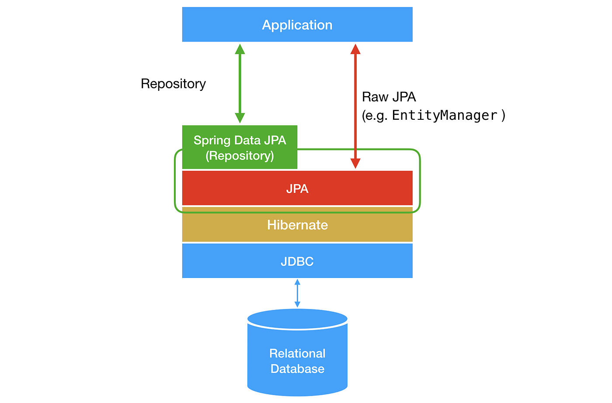
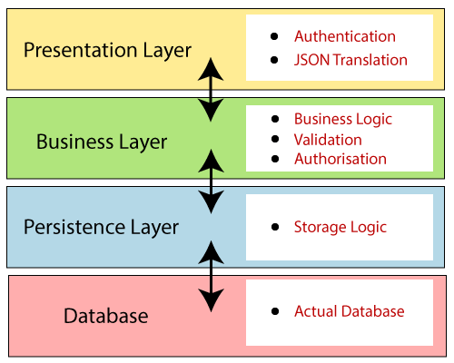
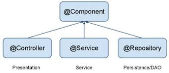
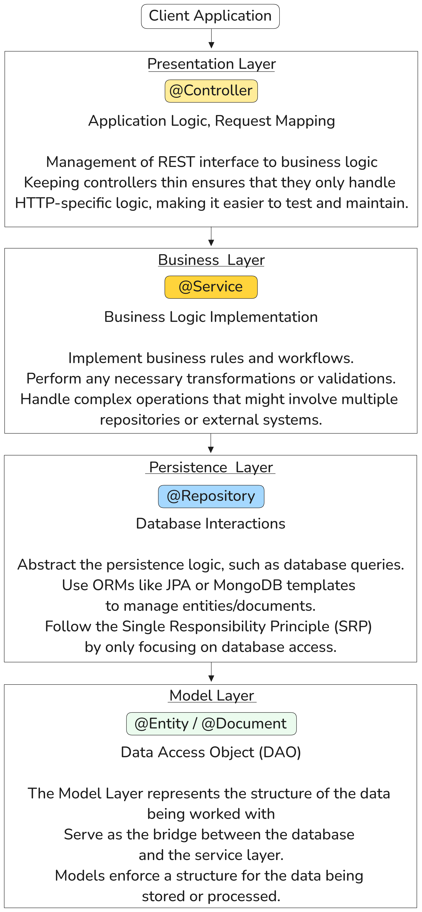

## Object Relationship Mapping (ORM)

Object-Relational Mapping (ORM) bridges the gap between object-oriented programming and relational databases. It allows developers to work with database entities as Java objects without writing complex SQL queries.

Consider a Java class `User` and a database table called `users`.  
ORM Frameworks like **Hibernate**, **EclipseLink** can map the fields in the Users class to columns in the users table making it easier to perform CRUD operations

---

## Java Persistence API (JPA)

Java Persistence API (JPA) is a specification that defines how Java objects can be persisted to a relational database. JPA is not a framework but a set of interfaces and guidelines. Hibernate is the most common JPA implementation

It is a way to achieve ORMs, includes interfaces and annotations that you use in your Java classes, requires a persistence provider (ORM tools) for implementation

Example

```java
@Entity
public class User {
    @Id
    @GeneratedValue(strategy = GenerationType.IDENTITY)
    private Long id;

    private String name;

    // Getters and setters...
}
```

In this example
`@Entity`: Marks the class as a JPA entity.  
`@Id`: Specifies the primary key.  
`@GeneratedValue`: Indicates the primary key generation strategy.

---

## Spring Data JPA

Spring Data JPA is built on top of JPA specification, but it is **NOT** an implementation of JPA. Instead simplifies working with JPA by providing higher level abstractions and utilities. However, to use Spring Data JPA implementation effectively, you still need a JPA implementation like **Hibernate**, **EclipseLink** or other JPA-Compilant provider to handle the actual database interactions

Provides built-in methods like `findById`, `save`, `delete`, etc.

Example:

```java
@Repository
public interface UserRepository extends JpaRepository<User, Long> {
    List<User> findByName(String name);
}
```

`JpaRepository`: Provides CRUD methods out of the box.
`findByName`: Automatically creates a query to find users by their name

---

## Spring Data MongoDB

Spring Data MongoDB is part of the Spring Data project, designed for MongoDB, a NoSQL database. It provides similar abstractions as Spring Data JPA but for MongoDB.

Example:

```java
@Document(collection = "users")
public class User {
    @Id
    private String id;
    private String name;

    // Getters and setters...
}
```

`@Document`: Maps the class to a MongoDB collection.
`@Id`: Marks the field as the document's unique identifier.

---

Dependencies

```xml
<dependencies>
    <!--Spring Data MongoDB-->
    <dependency>
        <groupId>org.springframework.boot</groupId>
        <artifactId>spring-boot-starter-data-mongodb</artifactId>
    </dependency>

    <!--Spring Boot starter pack-->    
    <dependency>
        <groupId>org.springframework.boot</groupId>
        <artifactId>spring-boot-starter-web</artifactId>
    </dependency>
    
    <dependency>
        <groupId>org.springframework.boot</groupId>
        <artifactId>spring-boot-starter-test</artifactId>
        <scope>test</scope>
    </dependency>
</dependencies>
```

---

**Query Method DSL** and **Criteria API** are two different ways to interact with a database when using Spring Data JPA for relational databases and Spring Data MongoDB for MongoDB databases.

**Query Method DSL** is a simple and convenient way to create queries based on method naming conventions, while the **Criteria API** offers a more dynamic and programmatic approach for building complex and custom queries.

--- 

## Separation of Concern (SoC)

Separation of concerns (SoC) is a design principle that divides a program into separate sections, each addressing a specific concern.
This principle promotes modularization and can make code easier to maintain and scale.

In Spring Boot, we follow a layered architecture :



There are three types of Components:




The following architecture is followed for separation of concern in Spring Boot Applications

